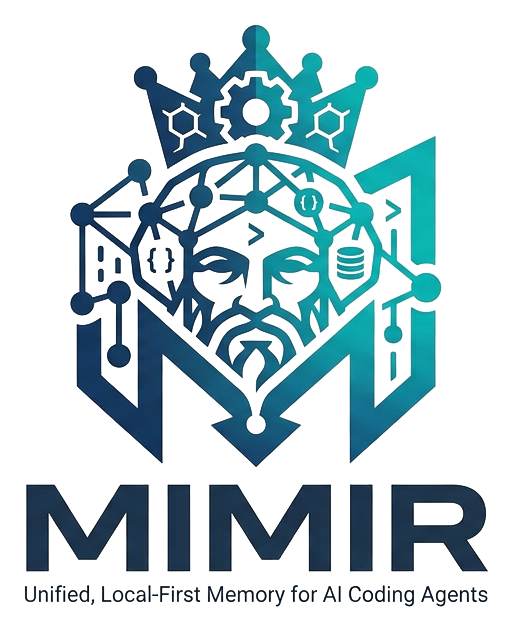
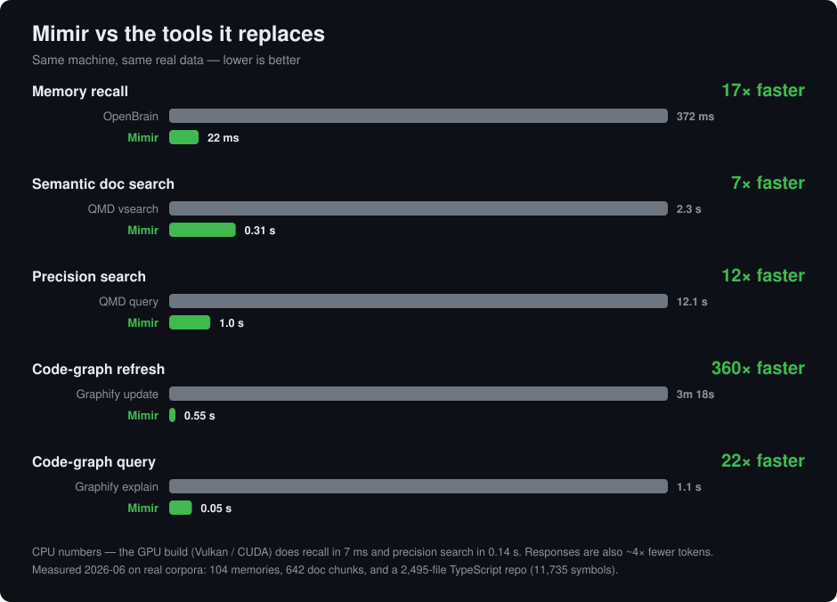

<div align="center">
  <picture>
    <source media="(prefers-color-scheme: dark)" srcset="assets/logo-dark.png">
    
  </picture>
</div>

**Unified, local-first memory for AI coding agents.** One SQLite store where
typed memories, indexed docs, and code symbols are all nodes in one graph —
searched together by hybrid BM25 + local-ONNX semantic retrieval, and exposed
to agents as a single, globally-registered MCP server.



- **One store, every project.** A single database with project scoping —
  cross-project knowledge surfaces wherever it's relevant, project noise
  doesn't.
- **Typed memories.** `gotcha`, `decision`, `insight`, `idea`, `note`,
  `person` — with tags, links, and automatic near-duplicate refusal.
- **Docs search.** Point it at any folder of markdown; an incremental,
  hash-driven indexer chunks it heading-aware (code fences never split) and
  keeps it fresh in milliseconds.
- **Hybrid search.** FTS5 BM25 (porter-stemmed, stopword-aware) + bge-small
  embeddings (quantized ONNX, in-process, no daemon, no API key), fused with
  reciprocal-rank fusion. Optional cross-encoder reranking (`--rerank`) when
  you want maximum precision over speed. No model downloaded? Everything
  still works, BM25-only.
- **Code graph.** Tree-sitter symbol extraction (Rust, TypeScript/JS,
  Python, Go) with call/import edges: `graph callers`, `impact` (blast
  radius of a diff), `path`, `hubs` — and code symbols participate in
  semantic recall. Link memories to functions and they surface together.
- **Self-learning.** Recall usage strengthens what helps (`mark` for
  explicit feedback); typed half-life decay quiets what doesn't; weekly
  LLM-free consolidation dedups, flags contradictions, distills clusters,
  and archives the dead — never destructively.
- **Made for agents.** Default output is one ~25-token line per hit.
  The MCP server registers once (`--scope user`) and serves every repo,
  detecting the current project from its working directory.
- **Local and private.** A memory tool holding your decisions and notes must
  be beyond suspicion: everything stays on disk, **zero telemetry**, ever.

## Install

Prebuilt binary (Linux x86_64/aarch64, macOS Apple Silicon):

```sh
curl -fsSL https://raw.githubusercontent.com/MakerViking/mimir/main/install.sh | sh
```

Windows: grab `mimir-windows-x86_64.zip` from the
[latest release](https://github.com/MakerViking/mimir/releases) and put
`mimir.exe` on your PATH.

From source (any platform with [Rust](https://rustup.rs)):

```sh
cargo install mimir-mem                 # the binary is named `mimir`
cargo install --path crates/mimir-cli   # …or from a checkout
```

### Optional GPU acceleration

CPU-only by default — GPU is an opt-in build feature (pick **one**):

```sh
# Cross-vendor: Vulkan (Linux), D3D12 (Windows), Metal (macOS) via Dawn.
# The right choice for AMD/Intel GPUs.
RUST_MIN_STACK=33554432 cargo install mimir-mem --features gpu-webgpu

# NVIDIA CUDA 12/13:
RUST_MIN_STACK=33554432 cargo install mimir-mem --features gpu-cuda
```

Notes:
- `RUST_MIN_STACK` works around a rustc/LLVM ThinLTO crash when linking the
  large onnxruntime GPU binary.
- The webgpu build dynamically links `libwebgpu_dawn.so` — copy it from the
  build cache next to the binary (the binary's `$ORIGIN` rpath finds it
  there), or set `LD_LIBRARY_PATH`:
  `cp $(find ~/.cache/ort.pyke.io -name 'libwebgpu_dawn.so' | head -1) ~/.cargo/bin/`
- `config.toml: embedding.device = "cpu"` forces CPU in a GPU build;
  the default `"auto"` falls back to CPU if GPU init fails.

Measured on an RX 6900 XT (Vulkan): bulk embedding 2.3× faster, recall
22 ms → 7 ms, `--rerank` 1.9 s → 0.14 s.

## Quickstart

```sh
mimir init                 # creates config + db, downloads the embedding model (~34 MB)
mimir init --no-model      # …or stay BM25-only / offline

# memories
mimir remember "SCRAM auth rejects non-ASCII passwords" -t gotcha --tags auth,postgres
mimir recall postgres password trouble
mimir get m:ABCDEF         # full body (also: mimir get notes.md:10-40)

# docs
mimir docs add ~/notes --name notes
mimir index                # incremental; re-run any time

# precision dial (all optional)
mimir embed --fetch --rerank                  # one-time reranker download (~150 MB)
mimir recall tricky semantic question --rerank  # cross-encoder rescoring (~1 s CPU, ~0.15 s GPU)
# config.toml: embedding.model = "bge-base-en-v1.5" — stronger semantic
# matching at the same query latency (index-time embedding is ~4x slower)

# code graph
mimir graph build                 # tree-sitter extraction, incremental
mimir graph callers resolve_ref   # who calls this?
mimir graph impact $(git diff --name-only)   # blast radius of a change
mimir graph viz --open            # interactive graph map (self-contained HTML)
mimir link m:ABC123 my_function --rel about  # decisions ↔ code

# feedback & hygiene
mimir mark m:ABC123 --useful      # strengthen future ranking
mimir consolidate --dry-run       # dedup/contradictions/distill/archive
mimir dashboard --open            # self-contained HTML telemetry panel

# escape hatches
mimir import openbrain export.txt | claude-memory <dir> | qmd
mimir export > backup.jsonl       # everything, always yours

# agents (Claude Code etc.) — register once, works in every repo
claude mcp add --scope user mimir -- mimir mcp
```

MCP tools: `recall`, `remember`, `get`, `link`, `graph`, `mark`, `status`.

### Works with any MCP client

Nothing here is Claude-specific: `mimir mcp` is a standard stdio MCP
server, so any MCP-capable agent can use it — Cursor, Windsurf, Cline,
Zed, VS Code (Copilot agent mode), Gemini CLI, Codex CLI, … For clients
configured via JSON, the entry is simply:

```json
{ "mcpServers": { "mimir": { "command": "mimir", "args": ["mcp"] } } }
```

The project is detected from the directory the client launches the server
in (override with the `MIMIR_PROJECT` env var). And agents without MCP can
just shell out — the CLI's default output is the same token-lean format
the server returns.

## How it works

Everything is a node — memories, files, chunks, projects, collections, tags,
annotations — in one SQLite database (WAL, FTS5, no extensions). Embeddings
are plain f32 blobs keyed by content hash + model, brute-force scanned
in-process (exact, single-digit ms at ≤200k items). Search legs are fused
with RRF (k=60); learned strength only ever acts as a tiebreaker. Concurrent
CLI + MCP-server access is the normal, supported case.

State lives in the platform-standard directories
(`~/.local/share/mimir`, `~/.config/mimir`, `~/.cache/mimir` on Linux);
set `MIMIR_HOME=<dir>` to put everything under one directory instead.

## Roadmap

v0.4 ships the complete original blueprint: memories, docs, code graph,
hybrid + reranked search, self-learning, importers, prebuilt binaries,
and the crates.io release ([mimir-mem](https://crates.io/crates/mimir-mem)).
Next: more languages, and whatever using it daily teaches us.

## License

MIT or Apache-2.0, at your option.
